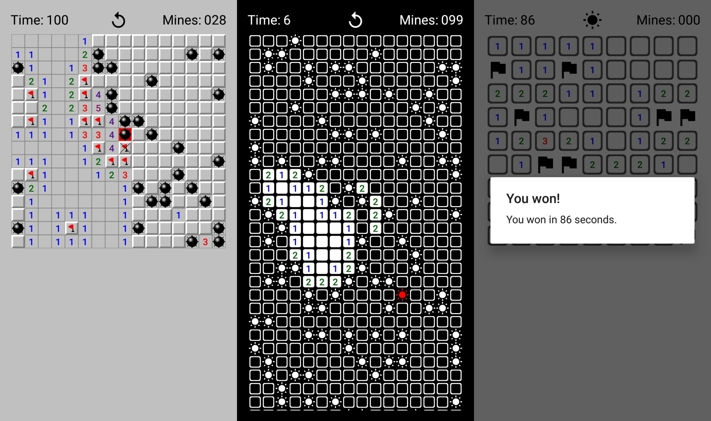

# Minesweeper
### Minesweeper for Android

The classic Microsoft Minesweeper game from the 90s.



## Features
- <b>3 levels of difficulty</b>
   > Choose between 3 levels of difficulty, Easy (9x9), Medium (16x16) and Hard (30x16).
- <b>3 different themes</b>
   > Choose between 3 different themes, Classic, Modern and Dark.
- <b>Dark Mode</b>
   > Get into the Dark Mode for the long nights.
- <b>Multi-language support</b>
   > Choose between 2 languages, Hebrew and English.


## Installation
Clone this repository and import it into **Android Studio**
```bash
$ git clone https://github.com/itielMaimon/Minesweeper
```

## Maintainers
This project is mantained by:
* [Itiel Maimon](http://github.com/itielMaimon)


## Contributing
1. Fork it
2. Create your feature branch (git checkout -b my-new-feature).
3. Commit your changes (git commit -m 'Add some feature').
4. Run the linter (ruby lint.rb').
5. Push your branch (git push origin my-new-feature).
6. Create a new Pull Request.
